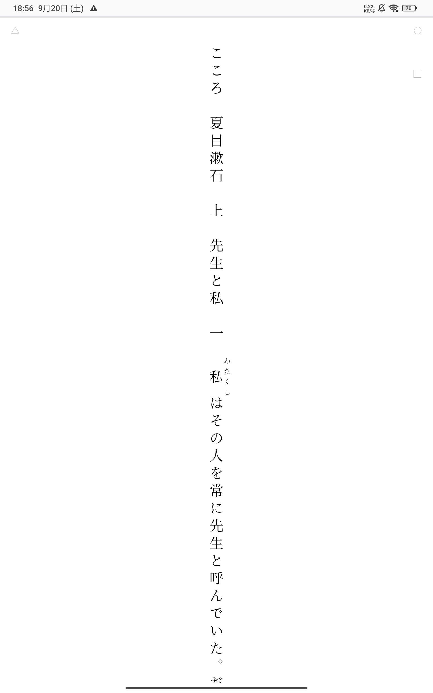
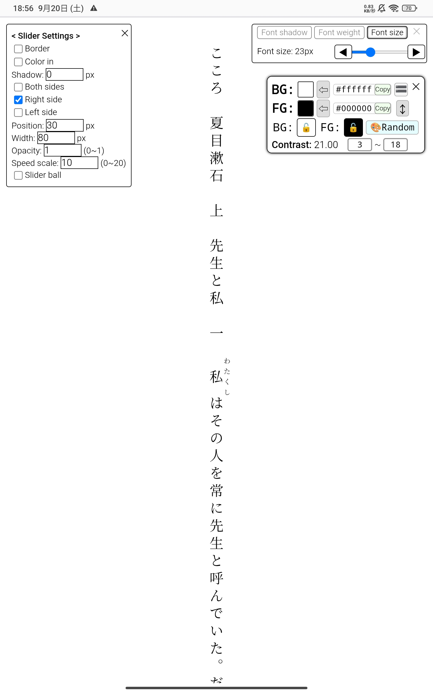
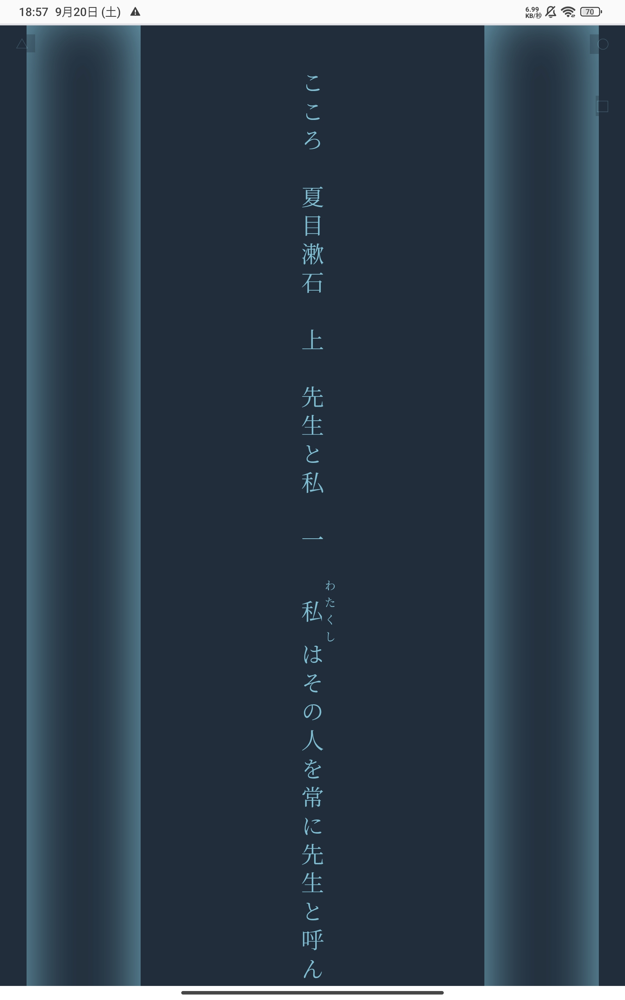
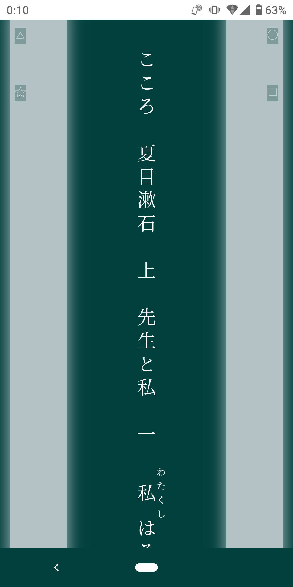

# WEB小説一行化ブックマークレット

## vertical-text-size-color.js
### はじめに
- AIが書いたコードをコピペ、ツギハギして作りました。<br><br>
- みもねる氏の｢[青空一行文庫ブックマークレット](https://qiita.com/mimonelu/items/26288a6347e958f500af)｣を知り、使ってみて、｢更にこれが出来たらすごいんじゃないか？｣と思う機能を付け加えていきました。<br><br>
- （追記:2025.11/07）AndroidとWindowsでは正常な動作を確認していますが、iOSでは自動スクロールとページ切り替えの挙動がうまくいかず、快適な利用は無理そうでした。<br><br>

### 対象サイト
- 対象サイトは青空文庫に加え、｢小説家になろう・カクヨム・アルファポリス」です。<br><br>
- 上記以外のサイトでも使いたい場合や、作者あとがきを含めたくない場合など、自由に改変してください。<br><br>
  - 小説本文のページで右クリックし、「開発者ツール」→「ページのソースを確認」から、本文を囲っているタグを確認することが出来ます。
<br><br>
### 実行
- ブックマークレットによる実行です。<br><br>
  - 実行方法はブラウザや端末によって異なるので詳しくは調べてください。<br><br>

<pre><code>javascript:(function(){var s=document.createElement('script');s.src='https://cdn.jsdelivr.net/gh/kuansy373/novel-viewer-bookmarklet@v1.5.3/vertical-text-size-color.js';document.body.appendChild(s);})();
</code></pre>
<br>
最初実行したときは、このような感じです。
<br><br>

<br>
右上、左上にうっすらとある〇や□、△をタップするといろいろ設定できます。
<br><br>

<br>
設定するとこんな感じにできます。左右に伸びてるのはスクロールバーの当たり判定です。<br>
（青タブレット、緑スマホ）
<br><br>
<p align="left">
  
  
</p>

### 強み
自動スクロールができる。色を自由に変えられる。長文に対応してる。
### 弱み
- iOSでは自動スクロールとページ切り替えが正常に使えない。<br>
- カクつきが発生する。(Chromeを使う、リフレッシュレートを60fpsにする、常時スクロールバーに触れる、などで改善することがあります)<br>
- フォントサイズを変更するとスクロール位置が変わる(ページ内検索をしおり替わりにするとよい)。<br><br>

### 注意点
- ソースコードが長く、モバイル端末ではブックマークのURL欄に入りきらないため、jsDelivr（CDN）での読み込みになっています。タグでバージョン管理しているため、最新リリースにするにはユーザー自身がタグを最新のものに書き換える必要があります。<br>※タグと実際のコードの結びつきを正確に確認したい場合は、「Releases」から該当タグが指しているコミットハッシュを参照ください。<br><br>
- ここに載せているjavascript:は常に最新のタグにしています。<br><br>
- v1.3.1を含むそれ以前のバージョンは、ブックマークレットを実行した際に新しいタブを開かず、元のページを作り変えるようになっているため、広告が読み込まれる前に実行してしまうとまれに宛先不明のメッセージがコンソールに大量に溜まることがあります。v1.4.1以降はDOMの完成後に処理が走るため、webページの読み込み完了を待たなくて大丈夫です。<br><br>
- このリポジトリの名前は最初「bookmarklet-release」でしたが、「novel-viewer-bookmarklet」に変更しました。（2025.12）<br><br>

### デフォルト設定 JSON
```json
{
  "color": "#000000",
  "backgroundColor": "#ffffff",
  "fontSize": "23px",
  "fontWeight": "400",
  "fontShadow": 0,
  "fontFamily": "游明朝",
  "scrollSettings": {
    "border": false,
    "colorIn": false,
    "shadow": 0,
    "right": true,
    "left": false,
    "position": 30,
    "width": 80,
    "opacity": 1,
    "speedScale": 10,
    "hideBall": false
  },
  "searchConfigs": [
    {
      "label": "何者",
      "side": "left",
      "offsetY": 0,
      "query": "何者",
      "engine": "https://www.google.com/search?q="
    },
    {
      "label": "元ネタ",
      "side": "left",
      "offsetY": 40,
      "query": "元ネタ",
      "engine": "https://www.google.com/search?q="
    },
    {
      "label": "日本語訳",
      "side": "left",
      "offsetY": 80,
      "query": "日本語訳",
      "engine": "https://www.google.com/search?q="
    },
    {
      "label": "意味",
      "side": "right",
      "offsetY": 0,
      "query": "とは",
      "engine": "https://www.google.com/search?q="
    },
    {
      "label": "読み方",
      "side": "right",
      "offsetY": 40,
      "query": "読み方",
      "engine": "https://www.google.com/search?q="
    },
    {
      "label": "意味 読み方",
      "side": "right",
      "offsetY": 80,
      "query": "意味 読み方",
      "engine": "https://www.google.com/search?q="
    }
  ]
}
```
※ テキスト選択時の検索ショートカットの表示を無くすには、`"searchConfigs": []` と、中身を空にすることで可能です。<br>
  - また、ブックマークレットであるため、データを保存する場所は用意できておらず、JSONをそのままユーザーがメモ帳などに置いておくことを想定しています。つど貼り付けてAPPLYです。
<br><br>

### バージョン大雑把まとめ
- v1.0.0: 縦一行、自動スクロール、色変更、文字サイズ調整。
- v1.1.ｘ: 自動スクロールスライダーの設定UIを追加。ページ切り替えの実装。`font-weight`，`text-shadow`の調整追加。
- v1.2.x: `font-family`の選択を追加。ローカルWEBサーバーによる設定保存を実装（のち削除）。
- v1.3.x: ページ切り替えとJSON保存のconfirmをモーダルUI化。JSONの貼り付け反映を実装。HTMLエスケープ追加。
- v1.4.x: 既存のタブを改変するのではなく、新しいタブに縦一行を開く。ブックマークレット実行後、DOM完成を待つ。ローカルWEBサーバー削除。テキスト情報パネル追加。ルビを数えないようにして文字数カウントのズレを無くした。
- v1.5.0: テキスト選択時に検索ショートカットメニューを表示。
<br>

### 不具合・要望
不具合、要望がありましたら、このリポジトリ内で報告するか、この [YouTubeの動画](https://youtu.be/b3lUvSqFgrY?si=7jlP4xZH5-1cneE3) のコメント欄に書き込んでください。可能な範囲で修正し、リリースしてここのタグを更新します。
