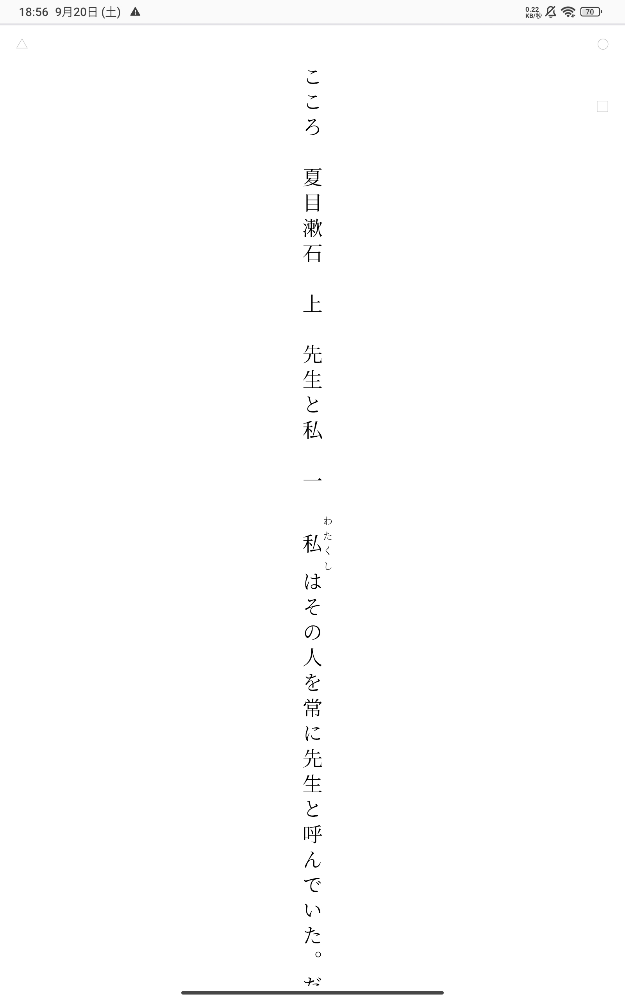
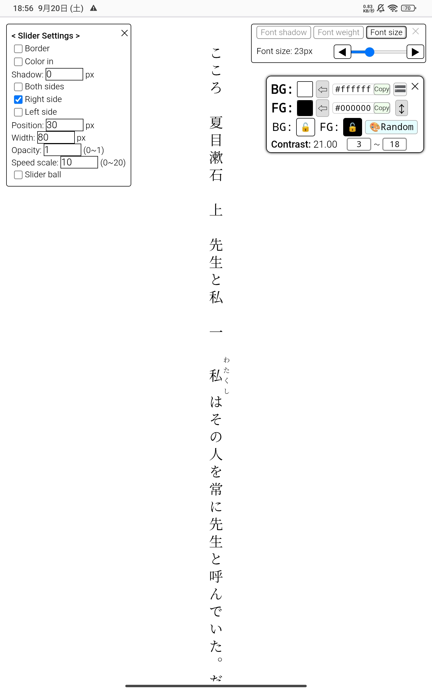
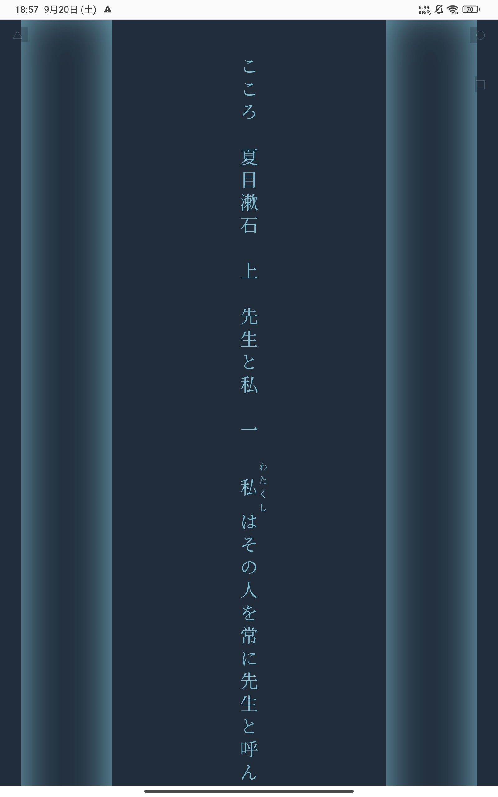
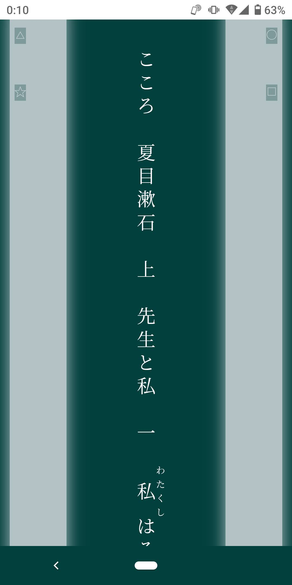

# WEB小説一行化ブックマークレット
### 目次
- [できること](#できること)
- [作ったきっかけ](#作ったきっかけ)
- [免責](#免責)
- [JSファイルについて](#jsファイルについて)
- [対象サイト](#対象サイト)
- [実行](#実行)
- [デフォルト設定 JSON](#デフォルト設定-json)
- [バージョン大雑把まとめ](#バージョン大雑把まとめ)
- [注意点](#注意点)
- [不具合・要望](#不具合要望)

### できること
- WEB小説を縦一行に表示して、自動スクロールで読むことができます。
- 文字サイズや色の設定ができます。
- ※ iOSでは自動スクロールとページ切り替えの挙動がうまくいかず、快適な利用は無理そうでした。
- ※ 自動スクロールでカクつきが発生することがあります。（Chromeを使う、リフレッシュレートを60fpsにする、常時自動スクロールスライダーバーに触れる、などで改善することがあります）

### 作ったきっかけ
- 「一行を読み終え、次の行を読むときに、読むべき行を見失ってしまう」ことが多く、読書に集中できなかったことがきっかけです。
- 「すべてを一行にしてしまえばいいのでは!?」と思い検索し、みもねる氏の記事｢[青空一行文庫ブックマークレット](https://qiita.com/mimonelu/items/26288a6347e958f500af)｣を見つけました。実際に使ってみて、画面スクロールが大変で読めないなと思ったのが最初で、そこからいろいろな機能を追加していきました。
- AIが書いたコードをコピペ、ツギハギして作りました。私は非エンジニアで、作り始めたころは変数のスコープすら理解していませんでした。今も本職の方が見ればおかしなところがたくさんあると思いますが、大目に見てほしいです。（コードの改善はしていきたいと思っています）

### 免責
- 本ツールは現状有姿で提供されます。動作を保証するものではありません。
- 利用によって生じたいかなる損害についても、作者は責任を負いません。
- 対象サイトの仕様変更により、予告なく動作しなくなる可能性があります。
- ご利用は自己責任でお願いします。

### JSファイルについて
- bookmarklet-main.js と novel-window.js の2つがあります。
  - bookmarklet-main.js は、ブックマークレット実行時に直接読み込まれるものです。本文を抽出、整形し、テキスト情報パネルを作成したあと、小説タブを開きます（このとき novel-window.js を `<script src>` で読み込みます）。
  - novel-window.js は、小説タブ側で動作するスクリプトです。小説タブのUI生成や動作を担います。

### 対象サイト
- 対象サイトは青空文庫に加え、｢小説家になろう・カクヨム・アルファポリス」です。
- 上記以外のサイトでも使いたい場合や、作者あとがきを含めたくない場合など、自由に改変してください。
  - bookmarklet-main.js の`document.querySelectorAll`によるタグ指定で対応できます。
  - 小説本文のページで右クリックし、「開発者ツール」→「ページのソースを確認」から、縦一行にしたい文章を囲っているタグを確認することが出来ます。

### 実行
- ブックマークレットによる実行です。
  - 実行方法はブラウザや端末によって異なるので、詳しくは調べてみてください。
  - [こちら](https://kuansy373.github.io/novel-viewer-bookmarklet/)で一応の説明はしていますが、ブラウザ、端末(OS)のバージョンが変わると方法も変わることがあると思います。

<pre><code>javascript:(function(){var s=document.createElement('script');s.src='https://cdn.jsdelivr.net/gh/kuansy373/novel-viewer-bookmarklet@408d08242d8cb14b68d519289d605a54259154e8/js/bookmarklet-main.js';document.body.appendChild(s)})()
</code></pre>
<br>
最初実行したときは、このような感じです。
<br><br>

<br>
右上、左上にうっすらとある〇や□、△をタップするといろいろ設定できます。
<br><br>

<br>
設定するとこんな感じにできます。左右に伸びてるのは自動スクロールスライダーバーの当たり判定です。<br>
（青タブレット、緑スマホ）
<br><br>
<p align="left">
  
  
</p>

### デフォルト設定 JSON
```json
{
  "color": "#000000",
  "backgroundColor": "#ffffff",
  "fontSize": "23px",
  "fontWeight": "400",
  "textShadow": 0,
  "fontFamily": "游明朝",
  "scrollSettings": {
    "right": false,
    "left": false,
    "shadow": 0,
    "opacity": 100,
    "border": true,
    "colorIn": false,
    "position": 30,
    "width": 80,
    "speedScale": 10,
    "showThumb": true
  },
  "searchConfigs": [
    {
      "label": "何者",
      "side": "left",
      "offsetY": 0,
      "query": "何者",
      "engine": "https://www.google.com/search?q="
    },
    {
      "label": "元ネタ",
      "side": "left",
      "offsetY": 40,
      "query": "元ネタ",
      "engine": "https://www.google.com/search?q="
    },
    {
      "label": "日本語訳",
      "side": "left",
      "offsetY": 80,
      "query": "日本語訳",
      "engine": "https://www.google.com/search?q="
    },
    {
      "label": "意味",
      "side": "right",
      "offsetY": 0,
      "query": "とは",
      "engine": "https://www.google.com/search?q="
    },
    {
      "label": "読み方",
      "side": "right",
      "offsetY": 40,
      "query": "読み方",
      "engine": "https://www.google.com/search?q="
    },
    {
      "label": "意味 読み方",
      "side": "right",
      "offsetY": 80,
      "query": "意味 読み方",
      "engine": "https://www.google.com/search?q="
    }
  ]
}
```
※ テキスト選択時の検索ショートカットの表示を無くすには、`"searchConfigs": []` と、中身を空にすることで可能です。
  - また、ブックマークレットであるため、データを保存する場所は用意できておらず、JSONをそのままユーザーがメモ帳などに置いておくことを想定しています。つど貼り付けてAPPLYです。

### バージョン大雑把まとめ
- v1.0.0: 縦一行、自動スクロール、色変更、文字サイズ調整。
- v1.1.x: 自動スクロールスライダーの設定UIを追加。ページ切り替えの実装。`font-weight`，`text-shadow`の調整追加。
- v1.2.x: `font-family`の選択を追加。ローカルWEBサーバーによる設定保存を実装（のち削除）。
- v1.3.x: ページ切り替えとJSON保存のconfirmをモーダルUI化。JSONの貼り付け反映を実装。HTMLエスケープ追加。
- v1.4.x: 既存のタブを改変するのではなく、新しいタブに縦一行を開く。ブックマークレット実行後、DOM完成を待つ。ローカルWEBサーバー削除。テキスト情報パネル追加。ルビを数えないようにして文字数カウントのズレを無くした。
- v1.5.0: テキスト選択時に検索ショートカットメニューを表示。
- v1.6.0: onetapUI内を充実。
- v2.0.0: ブックマークレットを実行したページが再読み込みされても小説タブを操作可能にした。

### 注意点
- ソースコードが長く、モバイル端末ではブックマークのURL欄に入りきらないため、jsDelivr（CDN）での読み込みになっています。
  - タグでバージョン管理していますが、読み込むファイルの指定にはコミットハッシュを使用しています。ブックマークレットコードが bookmarklet-main.js を読み込み、 bookmarklet-main.js が novel-window.js を読み込みます。なのでソースコードを確認する場合は、ブックマークレットコードから直接参照されているbookmarklet-main.js と、 bookmarklet-main.js が`<script src>`で読み込んでいる novel-window.js を確認する必要があります。
  - ※ 現在、このREADMEからコピーした「javascript:」で読み込まれるのは、 bookmarklet-main.js が [@408d082][hash1]、 novel-window.js が [@f2c1f7f][hash2]、タグは [v2.0.5][tag] です。

  [hash1]: https://github.com/kuansy373/novel-viewer-bookmarklet/blob/408d082/js/bookmarklet-main.js
  [hash2]: https://github.com/kuansy373/novel-viewer-bookmarklet/blob/f2c1f7f/js/novel-window.js
  [tag]: https://github.com/kuansy373/novel-viewer-bookmarklet/releases/tag/v2.0.5

- このリポジトリの名前は最初「bookmarklet-release」でしたが、「novel-viewer-bookmarklet」に変更しました。（2025.12）

### 不具合・要望
不具合、要望がありましたら、このリポジトリ内で報告するか、この [YouTubeの動画](https://youtu.be/b3lUvSqFgrY?si=7jlP4xZH5-1cneE3) のコメント欄に書き込んでください。可能な範囲で修正し、リリースして、各所のコミットハッシュ参照を更新します。
